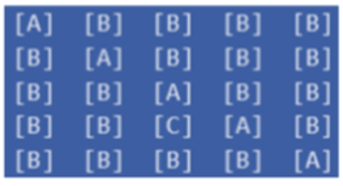

# Lista de Exercícios Básicos em Java 

## Descrição
Este repositório tem como objetivo reunir alguns exercícios para ajudar alunos iniciantes na linguagem Java. Todos os exercícios contam com um enunciado e com uma solução proposta. :coffee:

## Índice
* [Descrição](#descrição)
* [Enunciados](#enunciados)
  * [Lista 1](#--lista-1)
  * [Lista 2](#--lista-2)

## Enunciados
### - Lista 1
#### [Exercicio 001](listaexercicios01/ex001.java)
Verificação de número positivo:
Solicite ao usuário que digite um número.
Armazene o número em uma variável.
Verifique se o número é positivo.
Se o número for positivo, exiba a mensagem "O número é positivo".
Caso contrário, exiba a mensagem "O número é negativo".
#### [Exercicio 002](listaexercicios01/ex002.java)
Cálculo do desconto:
Solicite ao usuário que digite o valor do produto. Armazene o valor em uma variável. Verifique se o valor é maior que R$ 50,00.
Se o valor for maior que R$ 50,00, calcule o desconto de 10% sobre o valor e exiba o
novo valor com desconto.
Caso contrário, exiba a mensagem "Não há desconto para este produto".
#### [Exercicio 003](listaexercicios01/ex003.java)
Verificação de idade: Solicite ao usuário que digite sua idade.
Armazene a idade em uma variável. Verifique se a idade é maior ou igual a 18 anos. Se a idade for maior ou igual a 18 anos, exiba a mensagem "Você pode dirigir".  Caso contrário, exiba a mensagem "Você não pode dirigir".
#### [Exercicio 004](listaexercicios01/ex004.java)
Conversão de temperatura:
Solicite ao usuário que digite uma temperatura em Celsius.
Armazene a temperatura em uma variável.
Converta a temperatura para Fahrenheit utilizando a fórmula: F = (C x 1.8) + 32.
Exiba a temperatura em Fahrenheit.

#### [Exercicio 005](listaexercicios01/ex005.java)
Verificação de número par ou ímpar:
Solicite ao usuário que digite um número.
Armazene o número em uma variável.
Verifique se o número é par ou ímpar.
Se o número for par, exiba a mensagem "O número é par".
Caso contrário, exiba a mensagem "O número é ímpar".
#### [Exercicio 006](listaexercicios01/ex006.java)
Verificação de número múltiplo de 3:
Solicite ao usuário que digite um número.
Armazene o número em uma variável.
Verifique se o número é múltiplo de 3.
Se o número for múltiplo de 3, exiba a mensagem "O número é múltiplo de 3".
Caso contrário, exiba a mensagem "O número não é múltiplo de 3".

#### [Exercicio 007](listaexercicios01/ex007.java)
Cálculo do índice de massa corporal (IMC):
Solicite ao usuário que digite seu peso em quilos.
Armazene o peso em uma variável.
Solicite ao usuário que digite sua altura em metros.
Armazene a altura em uma variável.
Calcule o IMC utilizando a fórmula: IMC = peso / (altura x altura).
Verifique o resultado do IMC e exiba a mensagem "Abaixo do peso ideal", "Peso normal",
"Sobrepeso" ou "Obesidade", de acordo com a tabela de classificação do IMC.
#### [Exercicio 008](listaexercicios01/ex008.java)
Verificação de número primo:
Solicite ao usuário que digite um número.
Armazene o número em uma variável.
Verifique se o número é primo. Se o número for primo, exiba a mensagem "O número é primo".
Caso contrário, exiba a mensagem "O número não é primo".
#### [Exercicio 009](listaexercicios01/ex009.java)
Verificação de maioridade penal:
Solicite ao usuário que digite sua idade. Armazene a idade em uma variável.
Verifique se a idade é maior ou igual a 18 anos.
Se a idade for maior ou igual a 18 anos, exiba a mensagem "Você é penalmente
responsável".
Caso contrário, exiba a mensagem "Você não é penalmente responsável".
#### [Exercicio 010](listaexercicios01/ex010.java)
Conversão de moedas:
Solicite ao usuário que digite um valor em reais.
Armazene o valor em uma variável.
Solicite ao usuário que digite a cotação do dólar.
Armazene a cotação em uma variável.
Converta o valor em reais para dólares utilizando a fórmula: valor em dólares = valor em
  reais / cotação.
Exiba o valor em dólares.
#### [Exercicio 011](listaexercicios01/ex011.java)
Verificação de número par e múltiplo de 5:
Solicite ao usuário que digite um número.
Armazene o número em uma variável.
Verifique se o número é par e múltiplo de 5.
Se o número for par e múltiplo de 5, exiba a mensagem "O número é par e múltiplo de
5". Caso contrário, exiba a mensagem "O número não atende aos critérios".

#### [Exercicio 012](listaexercicios01/ex012.java)
Verificação de triângulo:
Solicite ao usuário que digite três valores que representam os lados de um triângulo.
Armazene os valores em variáveis.
Verifique se os valores formam um triângulo.
Se os valores formarem um triângulo, exiba a mensagem "Os valores formam um
triângulo".
Caso contrário, exiba a mensagem "Os valores não formam um triângulo".
#### [Exercicio 013](listaexercicios01/ex013.java)
Cálculo de desconto progressivo:
Desenvolva um programa que realize o cálculo de desconto progressivo em um produto, de
acordo com a seguinte tabela:

- Para valores menores ou iguais a R$ 50,00, não há desconto.
- Para valores entre R$ 50,01 e R$ 100,00, o desconto é de 5%.
- Para valores entre R$ 100,01 e R$ 200,00, o desconto é de 10%.
- Para valores acima de R$ 200,00, o desconto é de 15%.

  O programa deve solicitar ao usuário que digite o valor do produto e, em seguida, calcular o valor
  do desconto e o valor final do produto com desconto. Ao final, o programa deve exibir o valor
  original do produto, o valor do desconto e o valor final com desconto.
#### [Exercicio 014](listaexercicios01/ex014.java)
Verificação de ano bissexto:

- Solicite ao usuário que digite um ano.
- Armazene o ano em uma variável.
- Verifique se o ano é bissexto de acordo com as seguintes regras:
- Anos divisíveis por 4 são bissextos.
- Anos divisíveis por 100 não são bissextos, exceto os anos divisíveis por 400.
- Se o ano for bissexto, exiba a mensagem "O ano é bissexto".
- Caso contrário, exiba a mensagem "O ano não é bissexto".
#### [Exercicio 015](listaexercicios01/ex015.java)
 Soma de ímpares e múltiplos de 3

- Desenvolver um algoritmo que efetue a soma de todos os números ímpares que são múltiplos de três e que se encontram no conjunto dos números de 1
  até 500.
#### [Exercicio 016](listaexercicios01/ex016.java)
Maior e menor

- Desenvolver um algoritmo que leia a altura de 15 pessoas. Este programa
  deverá calcular e mostrar:
  A menor altura do grupo;
  A maior altura do grupo;
#### [Exercicio 017](listaexercicios01/ex017.java)
Quantidade arbitrária de valores

Desenvolver um algoritmo que leia um número não determinado de valores e calcule e escreva a média aritmética dos valores lidos, a quantidade de valores positivos, a quantidade de valores negativos e o percentual de valores negativos e positivos.
#### [Exercicio 018](listaexercicios01/ex018.java)
Escrever um algoritmo que leia uma quantidade desconhecida de números e conte quantos deles estão nos seguintes intervalos: [0-25], [26-50], [51-75] e [76-100]. A entrada de dados deve terminar quando for lido um número
negativo.

[:arrow_up: voltar para o índice :arrow_up:](#índice)

### - Lista 2
#### [Exercicio 001](listaexercicios02/ex001.java)
Faça um algoritmo estruturado que leia uma quantidade não determinada de números positivos. Calcule a quantidade de números pares e ímpares, a média
de valores pares e a média geral dos números lidos. O número que encerrará a leitura será zero.

#### [Exercicio 002](listaexercicios02/ex002.java)
Escrever um algoritmo que gera e escreve os números ímpares entre 100 e 200.

#### [Exercicio 003](listaexercicios02/ex003.java)
Escrever um algoritmo que leia um valor para uma variável N de 1 a 10 e calcule a tabuada de N. Mostre a tabuada na forma: 0 x N = 0, 1 x N = 1N, 2 x N = 2N, ...,
10 x N = 10N.

#### [Exercicio 004](listaexercicios02/ex004.java)
Fatorial
Escreva um algoritmo que leia um valor inicial A e imprima a sequência de valores do cálculo de A! e o seu resultado. Ex: 5! = 5 X 4 X 3 X 2 X 1 = 120
#### [Exercicio 005](listaexercicios02/ex005.java)
Elabore um algoritmo que leia números reais até que o valor da soma destes
números seja >=100. O algoritmo deverá fornecer ao final, quantos valores lidos foram necessários para satisfazer tal condição.
#### [Exercicio 006](listaexercicios02/ex006.java)
Escreva um algoritmo que receba a idade de várias pessoas e pare a execução
com a entrada de um numero não positivo. O algoritmo deve imprimir:
- O total de pessoas com menos de 21 anos;
- O total de pessoas com mais de 50 anos.
#### [Exercicio 007](listaexercicios02/ex007.java)
Crie um algoritmo para ler o preço de 10 produtos diferentes. Apresente o valor do produto mais barato e mais caro. Valide a entrada dos valores digitados.
#### [Exercicio 008](listaexercicios02/ex008.java)
Crie um vetor para armazenar 10 números inteiros digitados pelo
usuário e, em seguida, faça a soma de todos os valores do vetor.
#### [Exercicio 009](listaexercicios02/ex009.java)
Crie um algoritmo que leia 15 números aleatórios pelo teclado.
Depois de ler os 10 números, o algoritmo deve apresentar:

◦ Os valores digitados.

◦ Os valores digitados na ordem inversa.

#### [Exercicio 010](listaexercicios02/ex010.java)
Crie um vetor para armazenar 5 números inteiros digitados pelo
usuário e, em seguida, determine a média dos valores do vetor.

#### [Exercicio 011](listaexercicios02/ex011.java)
Crie um programa que solicita ao usuário que digite 8 números inteiros positivos e negativos e armazene-os em um vetor. Em seguida, exiba na tela a posição do último número negativo do vetor.

#### [Exercicio 012](listaexercicios02/ex012.java)
Crie um programa que solicite a entrada de 10 números pelo
usuário, armazenando-os em um vetor, e então monte outro vetor
com os valores do primeiro multiplicados por 5. Exiba os valores dos dois vetores na tela, simultaneamente, em duas colunas (um em cada coluna), uma posição por linha.

#### [Exercicio 013](listaexercicios02/ex013.java)
Crie um programa que armazene 10 números digitados pelo
usuário em um vetor. Após, exiba os valores dos números pares e
ímpares separadamente.

#### [Exercicio 014](listaexercicios02/ex014.java)
Ler um conjunto de números reais, armazenando-o em vetor e
calcular o cubo dos componentes deste vetor, armazenando o
resultado em outro vetor. Os conjuntos têm 10 elementos cada.
Imprimir todos os conjuntos.

#### [Exercicio 015](listaexercicios02/ex015.java)
Faça um programa que leia dois vetores A e B, ambos com 7
elementos. Em seguida, calcule e mostre na tela o vetor C, que é a
soma dos elementos correspondentes de A e B

#### [Exercicio 016](listaexercicios02/ex016.java)
Ler um conjunto de números reais, armazenando-o em vetor e calcular o quadrado das componentes deste vetor, armazenando o resultado em outro vetor. Os conjuntos têm 10 elementos cada.
Imprimir todos os conjuntos.

#### [Exercicio 017](listaexercicios02/ex017.java)
Faça um vetor de tamanho 15 preenchido com o seguinte valor:
(𝑖 + 5 ∗ 𝑖) %(𝑖 + 1), sendo i a posição do elemento no vetor. Em seguida imprima o vetor na tela.

#### [Exercicio 018](listaexercicios02/ex018.java)
Escreva um programa que leia números inteiros no intervalo [0,50] e os armazene em um vetor com 10 posições. Preencha um segundo vetor apenas com os números ímpares do primeiro vetor.
Imprima os dois vetores, 2 elementos por linha.

#### [Exercicio 019](listaexercicios02/ex019.java)
Faça um programa que leia dez conjuntos de dois valores, o
primeiro representando o número do aluno e o segundo
representando a sua altura em metros. Encontre o aluno mais
baixo e o mais alto. Mostre o número do aluno mais baixo e do
mais alto, juntamente com suas alturas.

#### [Exercicio 020](listaexercicios02/ex020.java)
Dada uma matriz 4x4 de inteiros, imprimir o número de linhas e o
número de colunas da matriz.

#### [Exercicio 021](listaexercicios02/ex021.java)
Faça um programa que leia uma matriz 3x4 de inteiros, substitua
seus elementos negativos por 0 e imprima a matriz original e a
modificada.

#### [Exercicio 022](listaexercicios02/ex022.java)
Faça um programa que leia uma matriz [5,5] de inteiros e
verifique se existem elementos repetidos.

#### [Exercicio 023](listaexercicios02/ex023.java)
Faça um programa que preenche uma matriz 4x4 com o produto
do valor da linha e da coluna de cada elemento. Em seguida,
imprima na tela a matriz.

#### [Exercicio 024](listaexercicios02/ex024.java)
Escreva um algoritmo que:

    ◦ Use uma matriz 5x5 de caractere

    ◦ Coloque “A” em todos os elementos da diagonal principal e“B” nos demais elementos.

    ◦ Coloque “C” na posição[3,2].

#### [Exercicio 025](listaexercicios02/ex025.java)
Escreva um método para calcular se um dado inteiro é par ou ímpar.

#### [Exercicio 026](listaexercicios02/ex026.java)
Escreva uma função que retorne o menor número de um vetor
(números reais).
#### [Exercicio 027](listaexercicios02/ex027.java)
Implemente uma calculadora (números reais) com suas funções
básicas: soma, subtração, multiplicação e divisão.
#### [Exercicio 028](listaexercicios02/ex028.java)
Escreva uma função de potenciação, em que os dados de entrada
são: base e expoente (inteiros).

[:arrow_up: voltar para o índice :arrow_up:](#índice)
